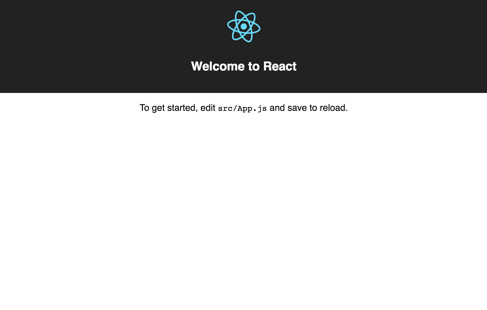

{#getting-started}
# Getting started

Can you believe this is the third time I'm writing a *"How to set up all the tools and get started"* section? The ecosystem moves fast! 😬

You can see the old versions as [Appendix A](#appendixA) – a roll-your-own environment that's almost the same as the one I'm about to show you, and [Appendix B](#appendixB) – a browserify-based environment (if you don't like Webpack).

In the summer of 2016, the React team released a tool called `create-react-app`. It creates a React app so that you can get started right away. All of the code in this book runs with an app set up like this.

Getting started with React has never been easier.

1. Make sure you have node.js
2. Install the app generator
3. Run the app generator

## Make sure you have node.js

Modern JavaScript development runs on node.js. Your code still ends up in a browser, but there are a few steps it has to go through before it gets there. Those toolchains run on node.js.

Go to [nodejs.org](https://nodejs.org/en/), download one of the latest versions, and run the installer. You can pick the more stable LTS (long-term-support) version, or the more gimme-all-the-features version. JavaScript toolchains run fine in both.

Server-side rendering might be easier with the fancy-pants version. More on that later.

## Install the app generator

Great, you have node and you're ready to go.

Run this command in a terminal:

```
$ npm install -g create-react-app
```

This installs a global npm package called `create-react-app`. Its job is to create a directory and install `react-scripts`.

Confusing, I know.

You can think of `create-react-app` and `react-scripts` as two parts of the same construction. The first is a lightweight script that you can install globally and never update; the second is where the work happens. You want this one to be fresh every time you start a new app.

Keeping a global dependency up to date would suck, especially considering there have been six major updates since Facebook first launched `create-react-app` in July 2016.

## Run the app generator

Superb! You have `create-react-app`. Time to create an app and get started with some coding.

Run this in a terminal:

```
$ create-react-app react-d3js-example
```

Congratulations! You just created a React app. *With* all the setup and the fuss that goes into using a modern JavaScript toolchain.

Your next step is to run your app:

```
$ cd react-d3js-example
$ npm start
```

A browser tab should open with a page that looks like this:



If that didn't work, then something must have gone terribly wrong. You should consult [the official docs](https://github.com/facebookincubator/create-react-app). Maybe that will help.

## What you get

Running `create-react-app` installs tools and libraries. There's around 80MB of them as of October 2016. This is why using a generator is easier than slogging through on your own.

Crucially, there is a single dependency in your project – `react-scripts`. But it gives you everything you need to build modern React apps.

* **Webpack** - a module bundler and file loader. It turns your app into a single JavaScript file, and it even lets you import images and styles like they were code.
* **Babel** - a JavaScript transpiler. It turns your modern JS code (ES6, ECMAScript2015, 2016, ES7, whatever you call it) into code that can run on real world browsers. It's the ecosystem's answer to slow browser adoption.
* **ESLint** - linting! It annoys you when you write code that is bad. This is a good thing. :)
* **Jest** - a test runner. Having tests set up from the beginning of a project is a good idea. We won't really write tests in this book, but I will show you how it's done.

All tools come preconfigured with sane defaults and ready to use. You have no idea how revolutionary this is. Check the appendixes to see how hard setting up an environment used to be. I'm so happy that `create-react-app` exists.

---

Besides the toolchain, `create-react-app` also gives you a default directory structure and a ton of helpful docs.

You should read the `README.md` file. It's full of great advice, and it goes into more detail about the app generator than we can get into here. The team also makes sure it's kept up-to-date.

All of the code samples in this book are going to follow the default directory structure. Public assets like HTML files, datasets, and some images go into `public/`. Code goes into `src/`.

Code is anything that we `import` or `require()`. That includes JavaScript files themselves, as well as stylesheets and images.

You can poke around `src/App.js` to see how it's structured and what happens when you change something. You're going to change bits and pieces of this file as you go through the book.

I suggest you keep `npm start` running at all times while coding. The browser will refresh on every code change, so you'll be able to see instant results.

## Install dependencies for this book

There are a couple of libraries we're going to use often in this book: D3 and Lodash. We're using D3 to do our heavy lifting and Lodash to make data manipulation easier.

You can install them like this:

```
$ npm install --save d3 lodash
```

Now your environment is ready! You should see a default React App page in the browser without errors. Keep `npm start` running as you follow the examples in this book.

Some examples are going to need other libraries. When that happens, I'll remind you to install them.
